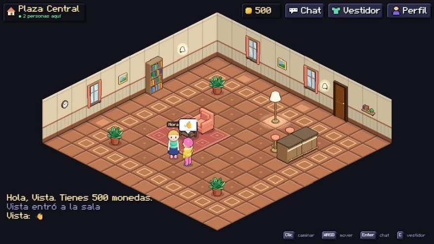

# Roomie 🏠



Mundo abierto 2D en pixel art con proyección isométrica, estilo Habbo.
Juego web hecho con **Phaser 3 + TypeScript + Vite**, con **servidor Node + Socket.io**
(multijugador en tiempo real).

> **Estado del proyecto y qué viene:** `docs/estado-actual.md`.

## Requisitos

- Node.js 24+ (`node -v`) — el servidor ejecuta los `.ts` directamente, sin build
- Una base Postgres (Supabase sirve): desde el login real, la identidad es
  obligatoria y no hay modo sin servidor

## Puesta en marcha

```bash
npm install && npm --prefix server install

cp server/.env.example server/.env    # y pegar dentro la cadena de conexión
npm --prefix server run db:migrate    # crea el esquema
```

Y luego, en dos terminales:

```bash
npm run dev:server   # servidor del juego → :3001
npm run dev          # cliente Vite      → http://localhost:5173
```

Regístrate, y abre **otra pestaña con otra cuenta** para ver el multijugador
(la misma cuenta no puede estar dentro dos veces).

Otros comandos:

```bash
npm run typecheck                        # tsc del cliente + tsc del servidor
npm run build                            # compilación de producción en dist/
npm run preview                          # previsualizar el build
node tools/prueba-normas.mjs             # filtro del chat y edades, sin servidor
node tools/smoke-multiplayer.mjs         # E2E: registra cuentas reales y juega
npm --prefix server run db:check         # ejerce los invariantes de la base
npm --prefix server run db:migrate       # aplica db/migrations/*.sql
node tools/genassets.mjs                 # regenera tileset, paredes y mapas (¡pisa los mapas!)
node tools/genassets.mjs --solo=paredes  # sólo el arte, sin tocar los mapas
node tools/genavatar.mjs                 # regenera las capas del avatar
node tools/genavatar.mjs --preview=dir   # ...y vistas previas ampliadas en dir/
node tools/genmuebles.mjs                # regenera el mobiliario (--preview=dir igual)
node tools/genfuente.mjs                 # regenera la fuente pixel (roomie.ttf)
```

## Roadmap

Hecho:

- [x] Isométrico, avatar animado, A\* y colisiones, dos salas con puertas
- [x] Multijugador con servidor autoritativo, chat y personalización
- [x] **Movimiento sin tirones**: simulación con tiempo real e interpolación
- [x] **Capas de interfaz** separadas del mundo
- [x] **Teclado en móvil** y panel de chat con historial
- [x] **Pixel art de verdad** y una identidad visual por sala
- [x] **Catálogo de mobiliario** compartido entre cliente y servidor
- [x] **Base de datos Postgres** con cuentas, libro mayor e inventario
- [x] **Login real** con sesiones persistentes
- [x] **Avatar nuevo**: por capas, 8 direcciones, a la escala de la sala, con vestidor
- [x] **Convivencia**: cada uno en su baldosa, clics en marcha sin tirones
- [x] **Guía de estilo** (`docs/guia-de-estilo.md`): una escala, una cámara, una luz
- [x] **Muebles en 3D** con el color del tema de cada sala, paredes decoradas y luz de ambiente
- [x] **Interfaz pixel art**: fuente propia, HUD, login, chat y vestidor rehechos
- [x] **Interfaz fina y propia** (líneas de 1 px), teclado que cruza puertas y se sienta, y **zoom** (rueda, + / −, arrastrar)
- [x] **Seguridad para niños y niñas**: edad privada, chat de frases, filtro de datos personales, bloquear y reportar

Siguiente:

- [ ] **Mi primer piso**: llegar a la terminal, ganarse las llaves, decorar tu casa
- [ ] **Salir a La Manzana**: el barrio, amigos y compartir ubicación
- [ ] **Vivir**: trabajo, hambre y comida, vehículos propios
- [ ] **Presumir**: caras, rasgos y moda por estilos; comercio seguro
- [ ] **La cima**: eventos, tendencias, mascotas, más barrios

El plan, con los cimientos que necesita cada paso para no tener que volver
atrás, en `docs/plan-piramide.md`. Las ideas de fondo, en
`docs/vision-mundo.md`.

## Arquitectura

```
src/
├── main.ts                  # configuración del juego
├── scenes/MainScene.ts      # render, entrada, chat, red, modales
├── state/                   # PURO (sin Phaser) — lo ejecuta el SERVIDOR
│   ├── avatarState.ts       #   movimiento y colisiones
│   ├── furniture-catalog.ts #   qué mueble estorba y en cuál se sienta uno
│   └── look.ts              #   catálogo del aspecto: estilos, colores, validación
├── net/
│   ├── protocol.ts          # PURO — eventos y tipos compartidos
│   └── client.ts            # socket.io + token de sesión
├── render/
│   ├── layers.ts            # bandas de profundidad (mundo / HUD / modal)
│   ├── theme.ts             # paleta y piezas de atlas por sala
│   ├── capas.ts             # PURO — combina y colorea capas generadas en 3D
│   ├── avatarSheet.ts       # PURO — hoja del avatar
│   ├── muebleSheet.ts       # PURO — materiales y color de los muebles por tema
│   └── texturas.ts          # capas → texturas de Phaser
├── entities/                # avatar (texturas por jugador) y mobiliario
├── ui/                      # kit pixel art, HUD, vestidor, <input> real (móvil)
└── utils/                   # iso, A*, guardado local, rampas de color

server/                      # paquete Node aparte
└── src/
    ├── index.ts             # socket.io + autenticación + simulación 20 Hz
    ├── world.ts             # lee los mapas de Tiled → colisiones
    └── db/                  # conexión, migraciones, cuentas, sesiones

db/migrations/*.sql          # esquema, en orden
tools/                       # generadores de assets y smoke test E2E
├── avatar/                  #   modelo 3D del avatar → capas de pixel art
├── muebles/                 #   modelos 3D del mobiliario
└── fuente/                  #   glifos de la fuente pixel
docs/                        # estado-actual.md + informe de cada tanda
```

- `AvatarState` es un módulo **sin dependencias de Phaser**: recibe órdenes
  (`keyboardMove`, `startPath`, `tick`) y devuelve posición/orientación.
  **Lo ejecuta el servidor** en un tick fijo de 50 ms; el cliente predice en
  local (instantáneo) y sólo dibuja a los demás con los snapshots a 20 Hz.
- El navegador se conecta a su propia origen y **Vite hace de proxy** de
  `/socket.io` hacia `:3001` (`vite.config.ts`), así que funciona igual en dev,
  con `vite --host` (red local) y detrás de cualquier hosting.
- Guardado automático cada 5 s y al cerrar la pestaña (`localStorage`,
  clave `roomie:save`). Si la celda guardada quedó bloqueada (p. ej.
  sentado en el sofá), se busca la celda libre más cercana.

## Multijugador (Fase 7)

| Mensaje | Cliente → servidor | Servidor → cliente |
|---|---|---|
| Entrar / cambiar de sala | `join`, `room` | `welcome` (id + todos), `players` (20 Hz) |
| Moverse | `move` (ejes -1..1), `path` (A*), `stand` | — |
| Aspecto | `look` (estilos y colores del catálogo) | reflejado en `players` |
| Chat | `text` (≤60 car., anti-spam 400 ms) | `chat` (incluido el eco propio) + avisos de sistema |

El servidor **valida** todo lo que llega: salas y celdas dentro de límites,
caminos con saltos de 8 vecinos que empiezan junto al avatar (o a 2-3 celdas:
el retraso de red se salva con un puente), intermedias libres y última celda
sólo si es asiento/puerta (mismas reglas que el A* del cliente). El aspecto se
corrige campo a campo contra el catálogo de `src/state/look.ts`.


## Assets y mapas

- `tools/genassets.mjs` regenera el tileset y `room1.json`:
  `node tools/genassets.mjs`
- `public/assets/room1.json` es un mapa de **Tiled** (isométrico 12×12):
  ábrelo con el editor Tiled para modificarlo. La capa `colisiones`
  (oculta) marca las celdas bloqueadas y la capa `objetos` coloca el
  mobiliario mediante las propiedades enteras `col` y `row` de cada objeto
  (tipo `sofa` o `mesa`).
- Las paredes traseras se colocan sobre la fila 0 y la columna 0 (piezas de
  `walls.png`, 96 px de alto).
- El avatar: `tools/genavatar.mjs` modela cada capa en 3D y la fotografía con
  la cámara del juego en 8 direcciones (`public/assets/avatar/*.png`). Cómo
  añadir prendas, en `docs/guia-de-estilo.md`.
- El servidor **lee los mismos `room1.json`/`room2.json`** (`server/src/world.ts`):
  si editas un mapa en Tiled, recuerda reiniciar el servidor (o déjalo con `--watch`).
