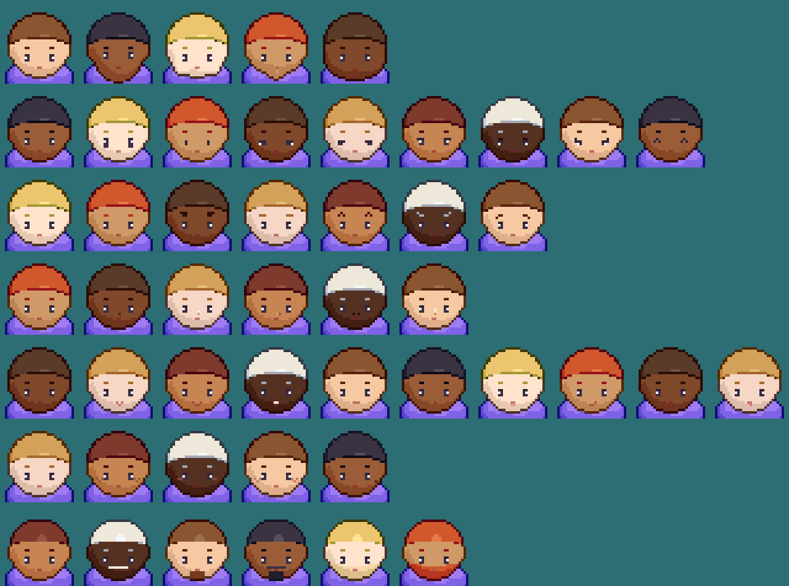
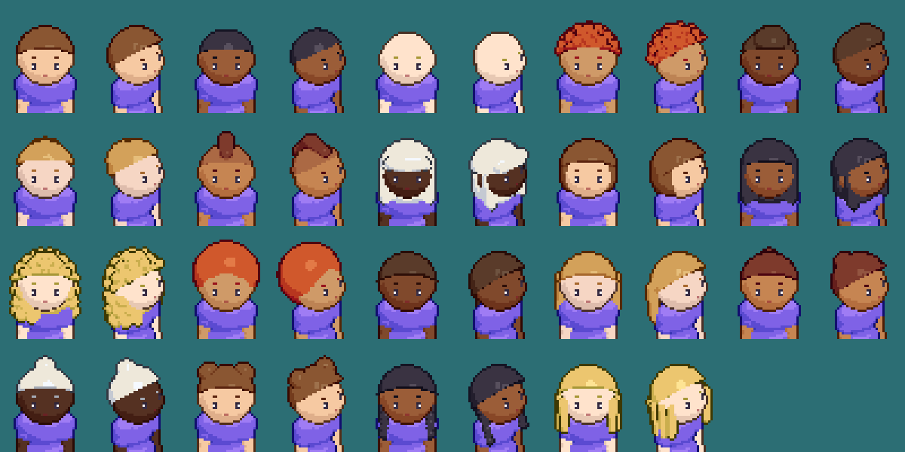

# Fase 11 — Caras, peinados y el perfil

**Fecha:** 27 de septiembre de 2026 · **Rama:** `feat/avatar-v2`

La primera mitad del cimiento C7 del plan, "el avatar definitivo antes de
fabricar moda": todo lo de la cabeza. Hasta ahora había una sola cara, seis
peinados y seis tonos de piel. Ahora cada uno puede hacerse una cara que se le
parezca. Y la ficha del perfil, que parecía un formulario, es una tarjeta de
verdad.

## Qué se puede elegir

| Parte | Opciones |
|---|---|
| Forma de la cara | redonda, ovalada, cuadrada, corazón, mofletes |
| Piel | 12 tonos, de claro a muy oscuro, con matices rosados, dorados y oliva |
| Ojos | redondos, grandes, puntitos, almendrados, finos, con pestañas, dormilones, felinos, felices |
| Color de ojos | oscuros, marrón, avellana, ámbar, verde, azul, gris, violeta |
| Cejas | normales, finas, gruesas, rectas, arqueadas, decididas, preocupadas |
| Nariz | pequeña, punto, botón, respingona, ancha, larga |
| Boca | normal, sonrisa, sonrisa amplia, con dientes, seria, pequeña, labios, pícara, sorpresa, lengua fuera |
| Detalles | ninguno, pecas, rubor, pecas y rubor, lunar |
| Barba | ninguna, bigote, perilla, bigote y perilla, de tres días, barba |
| Peinado | corto, rapado, sin pelo, rizado, tupé, hacia atrás, cresta, flequillo, bob, melena, rizos largos, afro, coleta, dos coletas, moño, moño alto, dos moños, trenzas, rastas |
| Color del pelo | 17: diez naturales (del negro al platino) y siete de fantasía |

**Sobre las "nacionalidades":** no hay caras por país. Hay rasgos que se
combinan: formas de ojos, narices, labios, pelo rizado, afro, trenzas o
rastas, y doce tonos de piel. Así cualquiera puede hacer a alguien que se le
parezca, o que se parezca a su gente, sin estereotipos.

## El vestidor, rehecho

- **Tres secciones** (Cara, Pelo y Ropa), cada una con sus partes: Forma, Piel,
  Ojos, Cejas, Nariz, Boca, Detalles y Barba en la Cara; Arriba, Abajo y Pies
  en la Ropa.
- **Cada opción se ve sobre tu propio avatar:** una miniatura de tu cara con
  esos ojos, de tu cabeza con ese peinado. Los rasgos, al doble, porque a
  tamaño real son dos o tres píxeles.
- **En la sección Cara, la vista previa se acerca a la cara** (a ×4,
  parpadeando) y se puede girar. En Pelo y Ropa, el cuerpo entero.
- **"Sorpréndeme"**: algo al azar, sólo en la sección que estás mirando.
- En un móvil en vertical, todo en una columna; si las opciones no caben, pasan
  de página.

## La ficha del perfil

- **La tuya** (botón de la persona): tu retrato de medio cuerpo, parpadeando,
  sobre un fondo del color de tu ropa. Debajo, tu nombre, tu usuario, desde
  cuándo juegas y si tienes casa. Luego tus monedas y tus créditos, y los
  botones "Cambiar aspecto" y "Cerrar sesión".
- **La de otro jugador**: en su menú, **Ver perfil**. Sólo sale lo de
  `PerfilPublico`: su retrato, su nombre y desde cuándo juega. Nunca la edad,
  ni dónde vive.
- **La norma**, en `src/state/normas.ts` (`puedeVerPerfil`): sólo se ve el de
  quien tienes delante (en tu sala), y nunca el de quien te ha bloqueado. El
  perfil no sirve para buscar a nadie.

## Cómo está hecho

**La cabeza, aparte del cuerpo.** Cada forma de cara es una capa
(`cabeza/<forma>`). El **cráneo es el mismo en todas**: lo que cambia es lo de
abajo (mofletes, mandíbula, barbilla). Como los peinados se cuelgan del
cráneo, cualquier peinado vale para cualquier cara. Mañana las gorras, igual.

**La cara son sellos en anclas** (`src/render/cara.ts`).
- A este tamaño un ojo son 2×3 píxeles; modelado en 3D, parpadearía entre uno
  y tres según cayera.
- El generador busca en 3D dónde cae cada rasgo (ojos, cejas, nariz, boca,
  mejillas) en la piel de cada forma de cara, en cada fotograma y cada
  dirección. Lo guarda en `public/assets/avatar/cara.json` (23 KB).
- El navegador estampa ahí el sello del estilo elegido: pocos píxeles, con una
  variante de frente y otra de perfil. Si una mano pasa por delante de la
  cara, no se pinta.
- Un rasgo nuevo es su id en `src/state/look.ts` y su sello: no hay que
  regenerar nada.

**La barba son zonas de la piel.**
- El generador marca en cada píxel de la cabeza a qué zona pertenece:
  mandíbula, bigote, perilla o patillas. Va en los bits altos del canal de la
  luz, que sólo usaba dos.
- El navegador tiñe la zona. La barba se adapta a cada forma de cara y
  conserva la luz del modelo.

**Peinados nuevos**, con piezas nuevas del generador:
- **Bultos**: esferas pequeñas fundidas sin suavidad. Dan el contorno
  ondulado del rizado, los rizos y la cresta.
- **Cadenas**: las trenzas y la cresta.
- **Mechones**: las rastas.
- **Un recorte que deja libre la cara**: el bob y las melenas.
- Lo que cuelga (coletas, trenzas, la cola de la coleta) va en su propio
  grupo. La línea del pelo cortaba la cola de la coleta a la altura de la
  nuca, y se veía corta.
- Los rizos van sin franja de brillo: con un brillo por rizo, salían moteados.

**El aspecto viaja en código compacto.** Con la cara, el aspecto tiene 17
campos, y viaja en cada instantánea de la sala, 20 veces por segundo por
jugador. Ahora va como `codificarLook`: 18 caracteres en vez de unos 400 de
JSON. En la base se sigue guardando el aspecto entero, y todo sale de una
sola tabla de catálogos en `look.ts` (tipo, validación, clave y código).

**Las cuentas de antes** conservan su aspecto: lo que les falta (la cara) sale
del aspecto por defecto, que es la cara de siempre.

## Un fallo viejo que salió por el camino

El brillo de los ojos no se veía nunca: se pintaba encima del propio ojo, y
la función sólo pintaba sobre la piel. Ahora es parte del sello.

## Verificación

- `node tools/prueba-avatar.mjs` (nuevo, 24 comprobaciones):
  - cada estilo del catálogo tiene su capa, y cada forma de cara sus anclas;
  - cada rasgo tiene su sello, y cada opción de la cara se nota de frente;
  - de frente, los ojos están a la misma altura; de espaldas no se ve la cara;
  - 500 aspectos al azar van y vuelven igual por el código compacto;
  - lo inventado vuelve al valor por defecto, y un aspecto de antes de las
    caras conserva lo suyo.
- `node tools/smoke-multiplayer.mjs`:
  - la cara llega a los demás en código compacto, y un rasgo inventado se
    corrige;
  - al entrar se sabe desde cuándo tienes la cuenta;
  - el perfil de quien tienes delante trae nombre, aspecto y desde cuándo
    juega, y nada más;
  - quien te ha bloqueado no puede ver tu perfil.
- `node tools/prueba-normas.mjs`: las normas de las casas y de los perfiles.
- `npm run typecheck`, `npm run build`, `npm --prefix server run db:check`.
- En el navegador, en escritorio y a 390×740:
  - el vestidor entero (secciones, partes, colores, páginas, "Sorpréndeme",
    guardar);
  - tu ficha y la de otro jugador en la plaza;
  - las caras nuevas en la sala.
- Vistas previas del generador (`--preview`): `caras.png`, `rasgos-*.png` y
  `peinados.png`, mirándolas.

## Lo que queda del C7 (con la moda)

- **La complexión** (delgada, media, ancha) y las medidas del cuerpo que lea la
  ropa.
- **Las ranuras**: ropa de abajo y de encima, gorras (con el pelo debajo),
  gafas, cuello, manos y espalda. Los peinados altos (moños, cresta, afro)
  necesitarán su versión "bajo la gorra".
- **Las poses** de montar y de comer.
- **La memoria**: son 35 capas (878 KB) y todas se descargan al empezar. Con
  la moda habrá que cargar sólo las que se usen.
