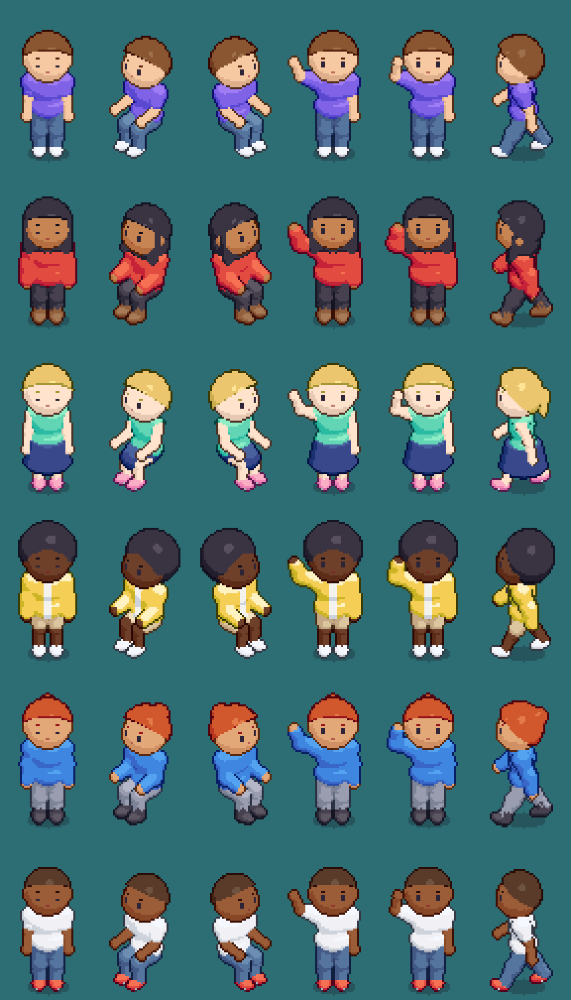

# Fase 4 — Convivencia en multijugador y avatar nuevo

**Fecha:** 26 de septiembre de 2026 · **Rama:** `feat/avatar-v2`

Dos tandas seguidas. Primero, los fallos que aparecían al caminar y al estar
junto a otro jugador. Después, el avatar: el muñeco de 16×24 escalado ×2 pasa a
un avatar por capas, en 8 direcciones y a la misma escala que la sala.


---

## Parte 1 — Convivir en la misma sala

### Hacer clic andando: el servidor tiraba el camino

**Síntoma:** al cambiar de destino en plena marcha, a veces el avatar se
frenaba o volvía hacia atrás.

**Causa:** el cliente calcula el camino desde la celda en la que *se ve*, y va
por delante del servidor (su entrada tarda en llegar). El servidor exigía que
el camino empezara a un paso de *su* posición. Cuando cliente y servidor caían
a cada lado del redondeo de celda, el camino empezaba a dos celdas y se
descartaba en silencio. Pasaba incluso en local: basta el medio tick (50 ms,
0,15 celdas) que el servidor va por detrás. El smoke test lo reproduce
mandando un camino que empieza a dos celdas; antes del arreglo fallaba.
El cliente seguía andando, el servidor no, y la corrección acababa
arrastrándolo hacia atrás.

**Arreglo:** si el camino empieza a 2 o 3 celdas, el servidor le antepone un
tramo corto calculado con el mismo A* (`bridged()` en `server/src/index.ts`).
No da ventaja: el puente se recorre andando. Más de 3 celdas sigue siendo
trampa y se rechaza.

### Dos avatares juntos: uno tapaba al otro al revés

La profundidad salía sólo de la fila de la celda, así que dos avatares en la
misma celda empataban. Phaser desempataba por orden de creación: el remoto
siempre tapaba al propio aunque estuviera detrás, y al cruzarse el orden
saltaba de golpe. Ahora `avatarDepth()` (`src/state/avatarState.ts`) suma hasta
0,4 según lo adelantado que esté cada uno dentro de su celda, sin salirse de la
franja que lo separa del suelo y de la fila de delante. La usan el avatar
propio y los remotos: si cada uno tuviera su fórmula, se ordenarían distinto
según quién mirara.

Los **nombres** tenían la profundidad de su avatar y el mueble de delante se
los comía. Ahora van en su propia banda, `LAYER.WORLD_LABEL`, por encima del
mundo y por debajo de las burbujas.

### Cada uno en su baldosa

Antes podías pararte encima de otro jugador, y dos personas se sentaban en el
mismo hueco del sofá, una dentro de la otra.

- **La regla vive en `AvatarState`**, que ejecutan cliente y servidor: si la
  celda final del camino la ocupa alguien quieto o sentado, se renuncia a ella
  y el avatar se queda en el centro de la celda anterior (`yieldIfTaken`). Se
  mira dentro del bucle de avance: en un mismo paso se puede llegar a la
  penúltima celda y seguir con lo que sobra.
- **Quien va andando no ocupa sitio**, porque está de paso. **Las puertas nunca
  se ocupan**, porque quien llega a una se está yendo.
- **El cliente** ignora el clic en una celda ocupada y el A* rodea a quien está
  parado en medio. El servidor no exige lo segundo: un snapshot algo viejo no
  invalida nada.
- **Al entrar a una sala** (o cruzar la misma puerta que otro) el servidor te
  coloca en la celda libre más cercana (`nearestFree` en `world.ts`).

### La corrección, afinada

- **Parados los dos, zona muerta de 0,1 celdas** en vez de 0,35. La grande
  existe porque, andando, el servidor va por detrás. Parados, ese desfase
  desaparece, y quedarse a un tercio de baldosa de donde te ven los demás era
  verte junto a alguien en tu pantalla y encima de él en la suya.
- **Sentado o de pie, manda el servidor** si discrepa más de 400 ms. Es lo que
  pasa cuando dos llegan al mismo asiento casi a la vez.
- **El arrastre puede salir de una celda bloqueada.** Sin eso, quien se
  levantaba de un asiento que el servidor le había negado se quedaba clavado
  en el sofá.

### El sofá de la plaza no se podía usar con el ratón

Bajo ese sofá hay una alfombra, y el cliente buscaba sólo el *primer* mueble de
la celda, que era la alfombra. El servidor sí lo aceptaba. `seatAtCell()` mira
todos los muebles de la celda.

---

## Parte 2 — El avatar nuevo

### Cómo se hace: 3D convertido en pixel art

Dibujar a mano 8 direcciones × 14 poses × cada prenda es inabarcable. Así que
el avatar se **modela en 3D con piezas redondeadas** (campos de distancia,
`tools/avatar/sdf.mjs`) colgadas de un esqueleto (`tools/avatar/model.mjs`). Se
**fotografía con la cámara del juego** (`tools/avatar/render.mjs`): la misma
proyección 2:1 que las baldosas, así los pies no patinan. Es la técnica de
*Dead Cells*.

```
node tools/genavatar.mjs               →  public/assets/avatar/*.png (17 capas, ~470 KB)
node tools/genavatar.mjs --preview=dir →  además, vistas previas ampliadas
```

- **8 direcciones, cada una con su dibujo.** Antes eran tres y el lado se
  reflejaba, así que la luz cambiaba de lado con el espejo.
- **14 fotogramas por dirección:** quieto (con parpadeo), caminar (8),
  sentado (con parpadeo) y saludo (2).
- **La ropa es una segunda piel** colgada de los mismos huesos, un poco más
  gruesa que el cuerpo. La manga sigue al brazo sin animarla a mano, y
  cualquier camiseta combina con cualquier pantalón.
- **La cara son calcomanías:** ojos de 2×3 px, cejas y boca se pintan en puntos
  de la superficie de la cabeza. Trazados como geometría, a este tamaño
  parpadeaban entre 1 y 3 píxeles según cayeran.

### Capas con profundidad, color en el navegador

Cada capa (el cuerpo, cada peinado, cada prenda) no guarda colores. Guarda, por
píxel, **qué material es, con qué banda de luz y a qué profundidad**. El
navegador (`src/render/avatarSheet.ts`) combina las capas del aspecto de cada
jugador quedándose con lo más cercano, las colorea con las rampas de su
aspecto y añade contorno y sombra. La manga tapa al torso porque está más
cerca, sin reglas de "qué va encima de qué" por prenda.

Consecuencia: **17 capas sirven para todas las combinaciones de estilos y
colores** (6 peinados × 5 torsos × 3 piernas × 2 calzados × 6 pieles × 11 × 15
× 15 × 15 colores). Combinar una hoja entera cuesta ~16 ms.

La vista previa del script usa exactamente el mismo `componer()` que el juego,
leyendo los PNG del disco: lo que se ve en ella es lo que se ve en el juego.

### El aspecto, ahora un catálogo

`Look` pasa de dos colores sueltos (`{shirt, hair}`) a estilos y colores del
catálogo (`src/state/look.ts`, compartido con el servidor):

```ts
{ piel, pelo, peloColor, torso, torsoColor, piernas, piernasColor, pies, piesColor }
```

- **El servidor valida campo a campo** con `sanitizeLook()`: lo que no está en
  el catálogo vuelve al valor por defecto, lo válido se respeta.
- **Las cuentas de antes no pierden su ropa:** el formato viejo se convierte
  al color de catálogo más parecido (distancia en OKLCH). La base no necesita
  migración porque `avatars.look` es `jsonb` y se reescribe al guardar.
- La dirección (`facing`) pasa a un número 0..7 y desaparece `flip`.

### El vestidor

Sustituye al panel de colores (tecla **C**, o **Perfil → Vestidor** en el
móvil):

- vista previa a doble tamaño que se puede girar;
- pestañas Pelo, Torso, Piernas, Pies y Piel;
- miniaturas de cada estilo **sobre tu propio avatar**;
- colores del catálogo.

Trabaja sobre un borrador: nada llega al servidor hasta Guardar. Al crear una
cuenta se abre solo ("¡Bienvenido a Roomie!"). El formulario de registro ya no
pide colores.

### Escala y luz únicas

- El avatar va a **×1**, como la sala (antes ×2, con el doble de grano).
- **Paredes de 96 px** (antes 48) y **puertas de 72 px** (antes 40): con el
  avatar de 64 px, la sala parecía una caja de zapatos.
- **La luz de las paredes estaba al revés** que la de los muebles. Ya coinciden.
- Los asientos dicen su altura y hacia dónde se mira: en el sofá se mira al
  suroeste y en el taburete a la barra.

Todo esto queda escrito en `docs/guia-de-estilo.md`.



---

## Cómo se verificó

| | Con |
|---|---|
| Camino con 2 celdas de retraso: se acepta y llega | smoke test 3b |
| Camino a 5 celdas: se sigue rechazando | smoke test 5 |
| Pararse junto a alguien, no encima | smoke test 3c |
| Asiento ocupado: te quedas de pie al lado | smoke test 3c |
| Dos que piden la misma celda al entrar: aparecen juntos | smoke test 1 |
| Dirección 0..7 sin espejo; sentado mira como el asiento | smoke test 1 y 3 |
| Aspecto antiguo convertido; estilo inventado rechazado campo a campo | smoke test 1 y 3d |
| 8 direcciones, caminar, poses, todos los estilos | vistas previas del generador |
| Dos jugadores juntos, taburete, sofá, vestidor, guardar | navegador real con un segundo jugador por socket |

`npm run typecheck`, `npm run build`, `node tools/smoke-multiplayer.mjs` (39
comprobaciones) y `npm --prefix server run db:check`: todo en verde.

### Probar en el navegador con la ventana oculta

Con la ventana de Chrome oculta, el juego va a 2 fps y los temporizadores se
frenan. Para probar se puede mover el bucle a mano, cediendo al navegador con
`MessageChannel`, que no se frena, para que lleguen los mensajes del servidor:

```js
const L = __roomie.loop;
const ceder = () => new Promise(r => { const c = new MessageChannel(); c.port1.onmessage = () => r(); c.port2.postMessage(0); });
async function correr(ms) {
  L.sleep();
  const fin = performance.now() + ms;
  while (performance.now() < fin) {
    const t0 = performance.now(); L.step(t0);
    while (performance.now() - t0 < 16) await ceder();
  }
  L.wake();
}
```

Los clics reales tampoco llegan con la ventana oculta, porque Phaser procesa la
entrada en su bucle. Se simulan con `PointerEvent` sobre el canvas, en la
posición de pantalla del botón.

---

## Pendiente

- **Muebles con el mismo generador 3D** que los avatares: hoy son polígonos
  vectoriales. Siguen la guía de luz y contorno, pero no son la misma técnica.
- **Memoria:** cada avatar en pantalla es una hoja de 672×672 (1,8 MB en la
  GPU). Con decenas de jugadores por sala habrá que generar sólo las
  direcciones en uso o compartir hojas entre aspectos iguales.
- **Las miniaturas del vestidor van a ×1:** se ven nítidas con el lienzo
  escalado, pero pequeñas en una pantalla de 960.
- **El teclado no respeta la ocupación:** con las flechas todavía se puede
  atravesar a alguien. Sólo el destino del clic está protegido.
