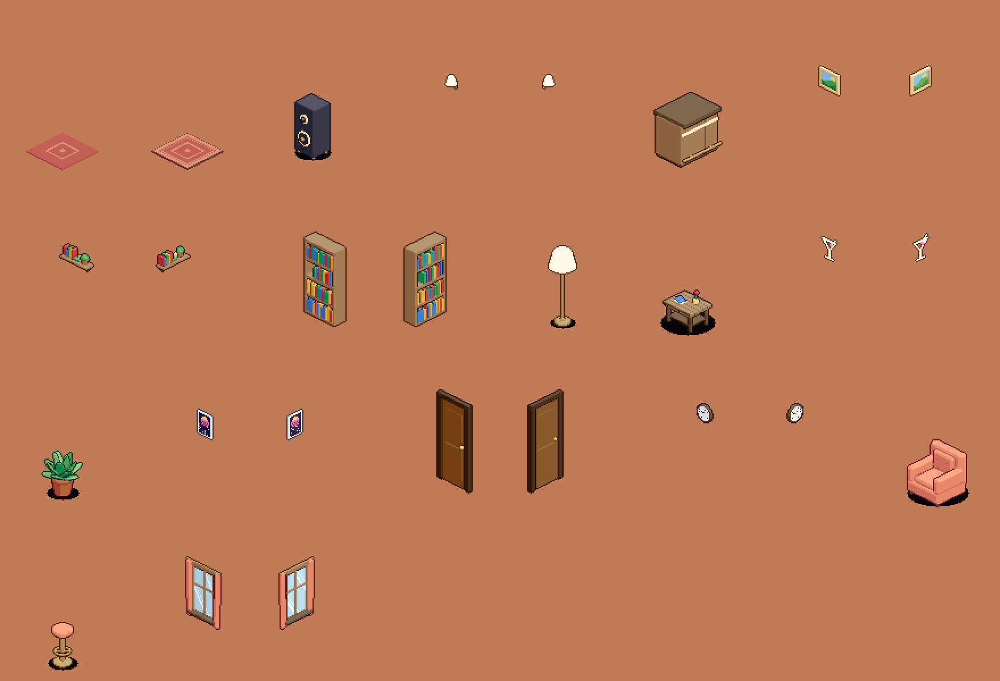

# Fase 5 — Muebles en 3D, paredes con vida e interfaz pixel art

**Fecha:** 26 de septiembre de 2026 · **Rama:** `feat/avatar-v2`

Después del avatar nuevo, el resto del juego se había quedado atrás. Los
muebles eran polígonos planos, las paredes estaban desnudas y la interfaz usaba
la letra monoespaciada del sistema. Esta tanda lleva a muebles, salas e
interfaz la misma técnica y las mismas reglas que el avatar.


---

## 1. La alfombra que cortaba el sofá

**Síntoma:** en la plaza, la alfombra tapaba la parte de abajo del sofá central
y de la mesa.

**Causa:** la alfombra se ordenaba como un mueble más, con la Y de su celda
(+0,25). Las celdas de alfombra que quedaban *delante* del sofá tenían más
profundidad que él y se dibujaban encima de la parte del sofá que invade su
trozo de pantalla.

**Arreglo:** dos bandas nuevas por debajo del mundo, `LAYER.SUELO` (baldosas) y
`LAYER.ALFOMBRA` (alfombras, charcos de luz, marcador del clic). Nada de lo que
se pisa puede tapar ya un mueble o un avatar, sea de la celda que sea. De paso
desaparece un riesgo que había que vigilar a mano: la baldosa de una celda
tapando al avatar que está en ella.

## 2. Muebles con el generador 3D

Los muebles se modelan en 3D (`tools/muebles/modelos.mjs`) y se fotografían con
la cámara del juego (`tools/genmuebles.mjs`), exactamente como el avatar.
Comparten volumen, luz, rampas de color y contorno, y dejan de parecer de otro
juego.

```
node tools/genmuebles.mjs                 →  public/assets/muebles/*.png + muebles.json
node tools/genmuebles.mjs --preview=dir   →  además, el catálogo con los dos temas
```

- **El color lo pone la sala.** Las imágenes guardan material, luz y
  profundidad. El navegador las colorea con el tema de cada sala
  (`src/render/muebleSheet.ts`): el mismo sillón es coral en la plaza y violeta
  en el club. Un tema nuevo no obliga a redibujar ningún mueble.
- **Detalle:** sillón con cojines y capitoné; mesa con balda, jarrón con flor y
  revistas; planta con hojas en espiral de dos verdes; barra con paneles y
  franja de luz; taburete con aro para los pies; altavoz con conos; estantería
  con libros de colores.
- **Alfombras de verdad:** 16 variantes por celda según qué vecinas son
  alfombra. La cenefa rodea la alfombra entera, no cada baldosa. Sin contorno
  por celda, que la partiría.
- **La combinación de capas se ha separado** (`src/render/capas.ts`): la usan el
  avatar, los muebles y las vistas previas de los dos generadores.



## 3. Paredes con vida, como en Habbo

Muebles de pared (`pared: true` en el catálogo): **ventana** con cortinas y
reflejos, **cuadro** con paisaje, **reloj**, **aplique**, **balda con libros**,
**neón** de cóctel y **póster** retro. Cuelgan del muro de la fila 0 o de la
columna 0, y el generador los fotografía girados para cada pared. La
**puerta** también es ya un modelo 3D.

La plaza tiene ventanas, cuadros, reloj, apliques, balda y estantería. El club
no tiene ventanas: tiene neones, pósters y apliques. Su pista de baile pasa a
violeta con líneas menta, porque en turquesa desaparecía sobre el suelo.

Los muebles nuevos están en la tienda: migración `005_catalogo_decoracion.sql`.
`db:check` exige que todo lo que el cliente dibuja se pueda comprar, y lo
detectó en cuanto faltaron.

## 4. Luz de ambiente

Todo tramado, en escalones de píxel, y sumado a lo que hay debajo (nunca
oscurece):

- charco de luz en el suelo bajo cada lámpara;
- halo en el muro alrededor de apliques y neones;
- el sol de las ventanas proyectado en el suelo;
- sombra de contacto al pie de los muros, que ancla las paredes al suelo.

## 5. Dos fallos de movimiento que salían al trabarse el navegador

Aparecieron al probar con la ventana oculta, pero pasarían igual en un móvil
lento o al volver de otra pestaña:

- **Avatar clavado a media celda.** Si el cliente se quedaba atrás, la
  corrección lo arrastraba hacia el servidor *más allá* del punto al que iba.
  El avatar seguía andando hacia ese punto, ya detrás, mientras la corrección
  tiraba hacia delante, y se quedaban en empate para siempre. `AvatarState` descarta
  ahora los puntos del camino ya rebasados (`skipPassed`).
- **Llegar a la puerta y no cruzar.** Si el desfase pasaba de 3 celdas, el salto
  a la posición del servidor borraba la puerta pendiente. Ahora se conserva y,
  si el salto te deja en la puerta, cruzas.

## 6. Interfaz pixel art

**Fuente propia, "Roomie Pixel".** Glifos de 5×7 proporcionales, con tildes, ñ,
¡ y ¿ (`tools/fuente/glifos.mjs`), convertidos por `tools/genfuente.mjs` en un
TrueType de verdad (18 KB). Con 8 píxeles por em, a 8, 16 o 24 px cada píxel de
la letra cae en píxeles enteros. Al ser una fuente del navegador, lo que no
tiene (emojis) lo pone él. Se carga *antes* de arrancar Phaser, que mide cada
fuente una sola vez.

**Kit de interfaz** (`src/ui/kit.ts`): paneles, botones con tres estados
(normal, encima, pulsado), campos hundidos, chips y burbujas. Son piezas de 9
porciones dibujadas píxel a píxel: contorno casi negro, bisel claro arriba,
sombra abajo, esquinas redondeadas. Los iconos llevan el contorno puesto solo.
En la interfaz cada píxel son 2 del lienzo, igual que la letra a 16 px.

Con eso se rehízo casi todo:

- **HUD** (`src/ui/hud.ts`): "Plaza Central · 2 personas aquí" arriba a la
  izquierda; monedas y botones con icono (Chat, Vestidor, Perfil) a la
  derecha; chuleta de teclas que se va sola. Sustituye al texto de
  "Roomie — room1 / Clic/WASD · Enter…".
- **Login y registro:** logo con la casa, lema, panel, campos que se iluminan
  al escribir, y la sala a la vista, oscurecida, detrás del velo.
- **Chat:** la fuente nueva, con líneas partidas por ancho medido (la fuente es
  proporcional) y un campo hundido para escribir.
- **Burbujas** pixel art con cola, **nombres** en una pastilla discreta a 1×,
  **menú de avatar** y **vestidor** con el mismo kit.

---

## Cómo se verificó

| | Con |
|---|---|
| Sofá y mesa enteros sobre la alfombra | captura en el navegador, antes y después |
| Muebles, variantes y temas | vistas previas del generador (plaza y club) |
| Alfombra de 3×3 y 4×4 con la cenefa sólo por fuera | navegador |
| Paredes decoradas y luces | navegador, en las dos salas |
| Avatar arrastrado más allá de su camino llega igualmente | prueba en Node del tira y afloja |
| Puerta tras un tirón | traza del cliente en el navegador |
| Fuente válida para el navegador | `FontFace.load()` en Chrome, que rechaza los TTF mal formados |
| HUD, login, perfil, chat, burbujas, nombres, menú y vestidor | capturas en el navegador con un segundo jugador |
| Tienda y catálogo cuadran | `db:check` tras la migración 005 |

`npm run typecheck`, `npm run build`, `node tools/smoke-multiplayer.mjs` (39
comprobaciones) y `npm --prefix server run db:check`: todo en verde.

## Pendiente

- **Muebles que ocupan dos celdas** (sofá de dos plazas, cama): hoy todo mide
  una celda. Hace falta cortar el sprite por celdas para ordenarlo bien.
- **Girar muebles:** cada mueble mira hacia un solo lado (la estantería gira sola
  junto a la pared izquierda). La tabla `items` ya tiene `rot`.
- **Colocar muebles** desde el juego, que es lo siguiente del plan: el catálogo,
  los modelos y la tienda ya están.
