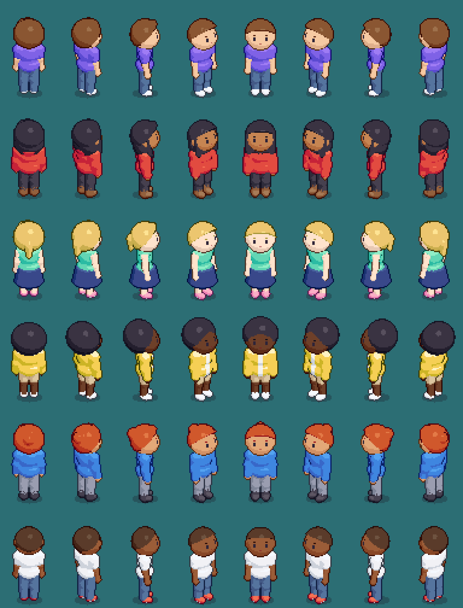

# Guía de estilo visual

**Última actualización:** 26 de septiembre de 2026

Roomie tiene que parecer un solo juego, no piezas de sitios distintos. Estas
reglas son las que hacen que un avatar, un sofá y una pared encajen. Casi
todas están en código, así que es difícil saltárselas sin querer. Cuando algo
nuevo "no pega", casi siempre rompe una de estas.

## 1. Una sola escala: 1 píxel de arte = 1 píxel de pantalla

Todo se dibuja a tamaño real (×1): suelo, paredes, muebles y avatares. Nada se
escala ×2 para "que se vea más grande". El avatar viejo iba a ×2 y cada píxel
suyo era el doble de gordo que los de la sala: se notaba enseguida.

| Pieza | Medida | Dónde vive |
|---|---|---|
| Baldosa | 64×32 (rombo 2:1) | `src/utils/iso.ts` |
| Avatar de pie | ~64 px de alto | `tools/avatar/model.mjs` (`P`) |
| Pared | 96 px de cara (1,5 avatares) | `WALL_H` en `tools/genassets.mjs` y `ALTO_PARED` en `MainScene.ts` |
| Puerta | 72 px (algo más que el avatar) | `ALTO_PUERTA` en `MainScene.ts` |
| Asiento del sofá | 14 px sobre el suelo | `sit.alto` en `src/state/furniture-catalog.ts` |
| Asiento del taburete | 30 px | ídem |

El avatar es la vara de medir: un mueble nuevo se diseña pensando en a qué
altura del cuerpo le llega (una barra, al pecho; un asiento, a la rodilla).

## 2. Una sola cámara

Proyección isométrica 2:1: una cámara a 30° sobre el suelo, girada 45°. El eje
`col` va a (32, 16) px y el eje `row` a (−32, 16). Lo que se modela en 3D (los
avatares) se fotografía con esa misma cámara (`CAM` en
`tools/avatar/render.mjs`). Con otra, los pies patinarían sobre las baldosas.

La única trampa permitida: la cabeza del avatar mira un poco hacia arriba
(`P.tilt`). Con la cámara a 30°, una cabeza recta enseña más coronilla que
cara. Habbo hace lo mismo.

## 3. Una sola luz

La luz viene **de arriba y del lado del eje col** (la derecha de la pantalla):

- lo que mira hacia arriba, lo más claro;
- lo que mira hacia +col (abajo a la derecha), tono medio;
- lo que mira hacia +row (abajo a la izquierda), en sombra.

Es la regla que ya seguían los muebles (tapa clara, cara sureste media, cara
suroeste oscura). Las paredes la tenían al revés y se corrigió en esta tanda.
El vector está en `LUZ` (`tools/avatar/render.mjs`).

## 4. Color: rampas de 5 tonos, siempre con la misma regla

Cada color es una **rampa**: `0 brillo · 1 luz · 2 media · 3 sombra · 4 contorno`.
El color "de catálogo" es el tono 1, el que se ve con luz. Los otros cuatro los
calcula `rampa()` (`src/utils/color.ts`), así que añadir un color es una línea.

La regla, en OKLCH (un espacio donde "más oscuro" se *ve* igual de más oscuro
para cualquier color):

- **las luces tiran hacia el amarillo, las sombras hacia el azul**, y ganan un
  poco de croma al oscurecer. Oscurecer multiplicando da sombras grises y
  sucias; girar el tono da sombras con color, como la luz real;
- **la piel tira hacia el rojo** en sombra, no hacia el azul, y con menos
  contraste;
- los grises reciben un tono frío mínimo para que su sombra no quede sucia.

Los catálogos de color (piel, pelo, ropa) están en `src/state/look.ts`.

## 5. Contorno: oscuro del propio color, nunca negro

- Contorno exterior de 1 px con el **tono 4 de la rampa** de lo que rodea. El
  negro convierte las cosas en alambres.
- Líneas interiores **sólo donde algo tapa a otra cosa** con un salto de
  profundidad (un brazo delante del pecho, el flequillo sobre la frente), con
  el contorno de lo que está *delante*. No se trazan líneas entre materiales
  pegados (la camiseta y el pantalón se separan por el color).

## 6. Pocas bandas de luz, y lejos de los umbrales

Tres o cuatro bandas por volumen, no degradados. Los umbrales se colocan
**lejos** de las orientaciones típicas: la cara frontal de un avatar cae holgada
en una banda. Con el umbral encima, medio cuerpo bailaba entre dos bandas y
salía a manchas.

**La piel va casi plana**: sin brillo (un parche claro en la frente parece una
mancha) y sin sombra dura por orientación (una barbilla en sombra profunda
parece barba).

## 7. Sombra en el suelo

Todo lo que se apoya en el suelo lleva una elipse de sombra debajo (violeta
muy oscuro, ~27% de opacidad). Ancla la pieza a la baldosa. Quien está sentado
no la lleva: su sombra caería sobre el asiento.

## 8. Profundidad con nombre

Ningún `setDepth` con un número suelto (`src/render/layers.ts`):
mundo < nombres < burbujas < HUD < paneles < modal. Dentro del mundo manda la
Y de pantalla, y dos avatares en la misma celda se desempatan por lo
adelantado que está cada uno (`avatarDepth`).

## 9. Interfaz

Fuente monoespaciada. Paleta de la interfaz:

| Uso | Color |
|---|---|
| Fondo de panel | `#12121a` |
| Caja / botón | `#1a1a2e` (hover `#2a2a4e`) |
| Borde | `#6d6d94` (suave `#3a3a55`) |
| Botón principal | `#6c5ce7` (hover `#8c7ce7`) |
| Títulos y selección | `#ffe9a8` |
| Texto secundario | `#9a9ad0` |

Los paneles fijos a la cámara se hacen con objetos sueltos, nunca con un
`Container` (ver `CLAUDE.md`).

## Cómo añadir cosas sin romper el estilo

**Un color de ropa o pelo:** una línea en `COLORES_ROPA` / `COLORES_PELO`
(`src/state/look.ts`). Las cinco tonalidades salen solas.

**Una prenda o un peinado:**
1. El estilo en `ESTILOS` (`src/state/look.ts`): así el servidor lo acepta.
2. Su forma en `tools/avatar/model.mjs`. Es una "segunda piel" colgada de los
   mismos huesos que el cuerpo, un poco más gruesa (mira `TORSO` o `PELO`).
3. `node tools/genavatar.mjs --solo=torso/nueva --preview=<carpeta>` y mirar
   la vista previa en las 8 direcciones y las poses.

**Un mueble:** una entrada en `src/state/furniture-catalog.ts` y su dibujo en
`src/entities/furniture.ts`, con la luz del punto 3 y el contorno del punto 5.
Si es un asiento, su `alto` y hacia dónde se mira.

## Lo que todavía no sigue la guía

- **Los muebles** se dibujan con polígonos vectoriales (`Graphics`), no con el
  generador 3D. Siguen la luz y el contorno, pero con otra técnica. El paso
  natural es modelarlos como los avatares: misma cámara, misma luz, mismas
  rampas. Tener objetos comprables en la tienda lo pedirá igualmente.
- **La puerta** también es vectorial.
